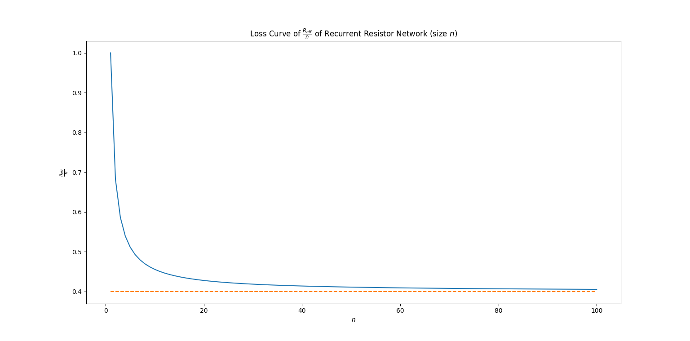

# Reccurent Resistor Networks

Extrapolating limits for Delta-Y transformation based Resistor Networks.

Question from OPhO 2022.

## Method Approached

Notably, we can slowly perform Delta-Y transformations and just keep appending to a strand of resistors. Thus, we can first draw out the first Delta, which starts at **a**.

$$R_{strand} = \frac{R_b R_c}{\sum R}$$

We also keep alternately adding 1 ohm to each of the other resulting connections due to the 1 ohm connections.

Thus, for any resistor network of size $n$, we perform Delta-Y at $2n$ times.

## Results

This was the computed loss curve for $\frac{R_{eff}}{n}$.
